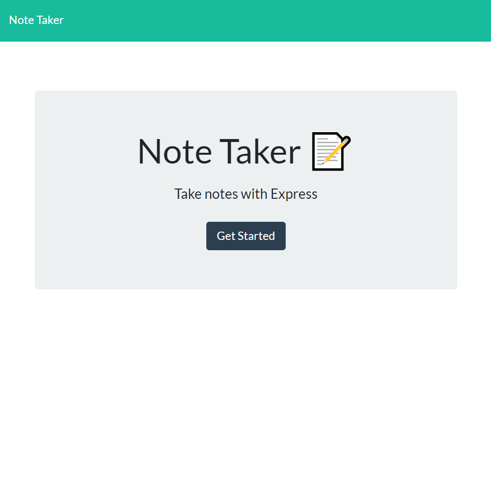
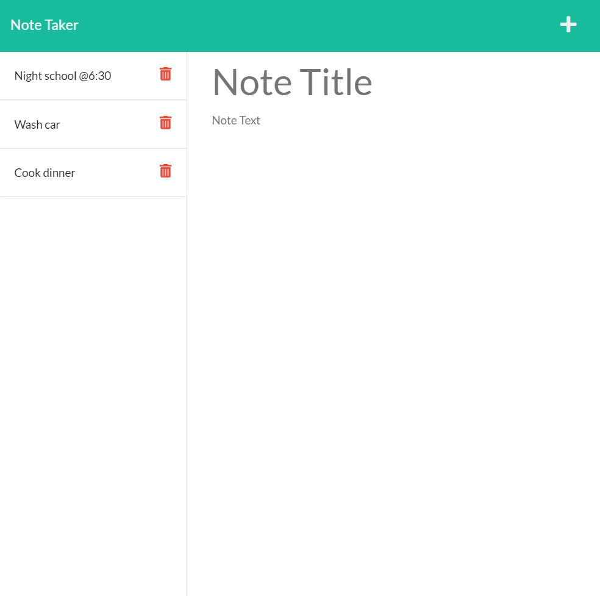

# Note Taker Application

## Description

Welcome to a note taker application! This was a fun project that helped reveal how the front-end and back-end come together. The app is deployed on Heroku and allows you to make different requests that are then handled by the server to update the database.

## Table of Contents

- [Installation](#installation)
- [Usage](#usage)
- [Contribution](#contribution)
- [Tests](#tests)
- [License](#license)

## Installation

No need to install this app! Since it has already been deployed on Heroku!

## Usage

Checkout and use the note taker application for yourself https://cryptic-caverns-38719.herokuapp.com/

Once you enter the app click 'Get started'. You will be taken to the notes route and either presented with 'No saved Notes' or a list of saved notes from your previous visit. On the right there will be a larger section to enter in a note. If you click on a note you will be able to read that note on the right hand side. Finally you can delete a note from the database with the little delete icon.

## Contribution

I would like to give credit to my bootcamp's developers for the starter code and Jacob from Ask BCS!

## Tests

N/A

## License

This project is covered under the Apache License 2.0 which you can read in depth here https://spdx.org/licenses/Apache-2.0.html
